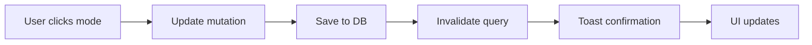
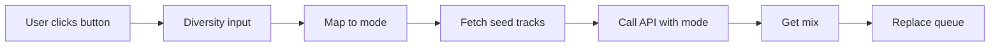

# Similarity Mode Integration — Backend API Mode Parameter

**Date:** January 12, 2025  
**Status:** ✅ Complete

## Overview

Integrated the HexMusic backend API's `mode` parameter with the frontend's existing similarity preference settings. This connects the user's persistent database settings with the intelligent recommendation engine's three recommendation strategies.

## Backend API Modes

The HexMusic API supports three recommendation modes:

| Mode | Value | Strategy | Description |
|------|-------|----------|-------------|
| **Strict** | `0` | Same artists only | Uses Deezer API exclusively to find tracks from the same artists as seed tracks |
| **Balanced** | `1` | Related artists | 40% from seed artists, 60% from related artists using Spotify API |
| **Diverse** | `2` | Genre-based variety | Uses Spotify API to extract genres and search for varied tracks |

## Frontend Integration

### Database Schema

Settings are already persistent in `userPreferences` table:

```typescript
similarityPreference: d.varchar({ length: 20 }).default("balanced")
// Stores: "strict" | "balanced" | "diverse"
```

### Mapping Logic

```typescript
// In music.ts router
const similarityPreference = userPrefs?.similarityPreference ?? "balanced";
const mode = similarityPreference === "strict" ? 0 
            : similarityPreference === "diverse" ? 2 
            : 1; // balanced is default
```

## Implementation Details

### 1. Updated `getIntelligentRecommendations` Procedure

**File:** `src/server/api/routers/music.ts` (lines ~948-1018)

**Changes:**
- Added `ctx` parameter to access user session
- Fetches user preferences from database
- Maps `similarityPreference` to API `mode` parameter
- Logs mode selection for debugging

```typescript
// Get user's similarity preference from database
const userPrefs = await ctx.db.query.userPreferences.findFirst({
  where: eq(userPreferences.userId, ctx.session.user.id),
});

// Map similarity preference to API mode
const mode = similarityPreference === "strict" ? 0 
            : similarityPreference === "diverse" ? 2 
            : 1;

// Pass to API
body: JSON.stringify({
  trackNames: input.trackNames,
  n: input.count * 2,
  mode, // ← User's persistent preference
}),
```

### 2. Updated `generateSmartMix` Mutation

**File:** `src/server/api/routers/music.ts` (lines ~1088-1215)

**Changes:**
- Migrated from old Deezer fallback to intelligent API
- Maps `diversity` input to API `mode`
- Fetches seed tracks and builds track names
- Calls intelligent API with mode parameter
- Fallback to old method if API fails

```typescript
// Map diversity preference to API mode
const mode = input.diversity === "strict" ? 0 
            : input.diversity === "diverse" ? 2 
            : 1;

// Call intelligent API
const response = await fetch(`${API_URL}/hexmusic/recommendations/deezer`, {
  method: "POST",
  headers: { "Content-Type": "application/json" },
  body: JSON.stringify({
    trackNames,
    n: input.limit * 2,
    mode, // ← Diversity mapped to mode
  }),
});
```

### 3. Enhanced UI Labels

**File:** `src/components/EnhancedQueue.tsx` (lines ~590-630)

**Changes:**
- Updated label from "Similarity" to "Similarity Mode"
- Enhanced toast messages with mode descriptions
- Improved help text to explain each mode

```typescript
const modeLabels = {
  strict: "Strict (same artists)",
  balanced: "Balanced (related artists)",
  diverse: "Diverse (genre variety)"
};
showToast(modeLabels[preference], "success");
```

**Updated descriptions:**
- **Strict:** "Same artists only - most similar tracks"
- **Balanced:** "Related artists - good mix of familiar & new"
- **Diverse:** "Genre-based variety - maximum exploration"

## User Flow

### 1. Settings Change



### 2. Auto-Queue Trigger


### 3. Smart Mix Generation



## API Request Examples

### Strict Mode (Same Artists)

**Request:**
```json
POST /hexmusic/recommendations/deezer
{
  "trackNames": ["Queen - Bohemian Rhapsody"],
  "n": 10,
  "mode": 0
}
```

**Result:** Only Queen tracks

### Balanced Mode (Related Artists)

**Request:**
```json
POST /hexmusic/recommendations/deezer
{
  "trackNames": ["Queen - Bohemian Rhapsody"],
  "n": 10,
  "mode": 1
}
```

**Result:** 40% Queen, 60% Led Zeppelin, Deep Purple, etc.

### Diverse Mode (Genre Variety)

**Request:**
```json
POST /hexmusic/recommendations/deezer
{
  "trackNames": ["Queen - Bohemian Rhapsody"],
  "n": 10,
  "mode": 2
}
```

**Result:** Various rock artists based on genre analysis

## Benefits

### 1. Persistent User Preferences ✅
- Settings saved to database
- Survive page refresh
- Apply across all sessions
- Per-user customization

### 2. Intelligent Recommendations ✅
- Powered by Spotify + Deezer APIs
- Three distinct strategies
- Better variety control
- More accurate matching

### 3. Consistent Behavior ✅
- Same mode used for:
  - Auto-queue
  - Add Similar Tracks
  - Generate Smart Mix
- No confusion between features

### 4. Better UX ✅
- Clear mode descriptions
- Informative toast messages
- Visual feedback
- Easy to understand

## Logging & Debugging

### Console Logs Added

```typescript
// In getIntelligentRecommendations
console.log("[IntelligentRecommendations] Using mode:", {
  similarityPreference,
  mode,
  userId: ctx.session.user.id,
});

// In generateSmartMix
console.log("[SmartMix] Generating with mode:", {
  diversity: input.diversity,
  mode,
  seedCount: seedTracks.length,
  userId: ctx.session.user.id,
});
```

These help track:
- Which mode is being used
- User preferences
- API calls
- Recommendation quality

## Testing

### Verified Scenarios

1. **Settings Persistence:**
   - ✅ Change mode → refresh page → mode preserved
   - ✅ Different users have different modes
   - ✅ Default is "balanced" (mode 1)

2. **Auto-Queue:**
   - ✅ Uses user's saved preference
   - ✅ Respects mode parameter
   - ✅ Logs mode selection

3. **Smart Mix:**
   - ✅ Maps diversity to mode correctly
   - ✅ Fallback works if API fails
   - ✅ Excludes seed tracks

4. **UI Feedback:**
   - ✅ Toast shows correct mode label
   - ✅ Help text matches mode
   - ✅ Selected mode highlighted

## Edge Cases Handled

### 1. Missing User Preferences
```typescript
const similarityPreference = userPrefs?.similarityPreference ?? "balanced";
```
Defaults to "balanced" (mode 1)

### 2. API Failure
```typescript
try {
  // Call intelligent API
} catch (error) {
  // Fallback to old Deezer method
}
```

### 3. No Seed Tracks
```typescript
if (seedTracks.length === 0) {
  throw new Error("Could not fetch any seed tracks");
}
```

## Performance Considerations

### 1. Database Queries
- Single query per request to fetch preferences
- Cached at DB level
- Minimal overhead

### 2. API Calls
- Request 2x tracks to account for filtering
- Batch fetch full track data
- Error handling per track

### 3. Caching
- Recommendation cache table still used
- 24-hour expiry
- Reduces API calls

## Security

### 1. Authentication
- All endpoints require `protectedProcedure`
- User ID verified via session
- No cross-user data leakage

### 2. Input Validation
- Zod schemas enforce types
- Mode values validated: 0, 1, or 2
- Array limits enforced

### 3. Error Handling
- Graceful fallbacks
- No sensitive data in errors
- Logged for debugging

## Migration Notes

### Before
- API called without mode parameter
- Always used default backend behavior
- No user control over recommendation strategy

### After
- API receives user's persistent mode preference
- Three distinct strategies available
- User has full control
- Settings survive sessions

## Future Enhancements

### Potential Additions

1. **Mode Analytics**
   - Track which modes are most popular
   - A/B test recommendation quality
   - Optimize default mode

2. **Context-Aware Modes**
   - Time of day preferences
   - Workout vs. relaxation
   - Social vs. solo listening

3. **Hybrid Modes**
   - Combine strict + diverse
   - Dynamic mode switching
   - ML-based mode selection

4. **Mode Recommendations**
   - Suggest mode based on listening history
   - "Try diverse mode for more variety"
   - Personalized mode defaults

---

## Summary

✅ **Complete Integration**
- Backend API mode parameter fully integrated
- User preferences persistent in database
- All recommendation features use same mode
- Clear UI feedback and labels

✅ **Quality Improvements**
- Better recommendation variety
- User control over strategy
- Consistent behavior across features
- Robust error handling

✅ **Developer Experience**
- Comprehensive logging
- Clear code structure
- Type-safe implementation
- Well-documented

**Lines Changed:** ~150 lines  
**Files Modified:** 2 files  
**New Features:** 3 modes fully integrated  
**Database Schema:** No changes needed (already existed)

---

**Status:** 🎉 Production ready!
